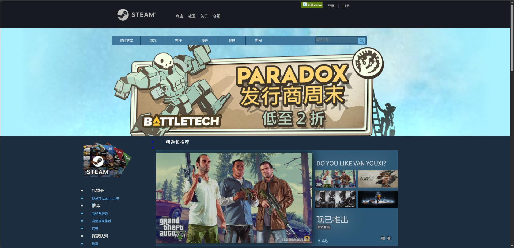
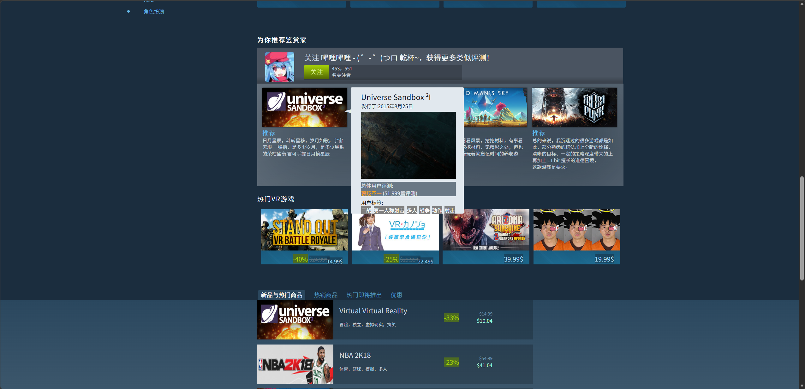
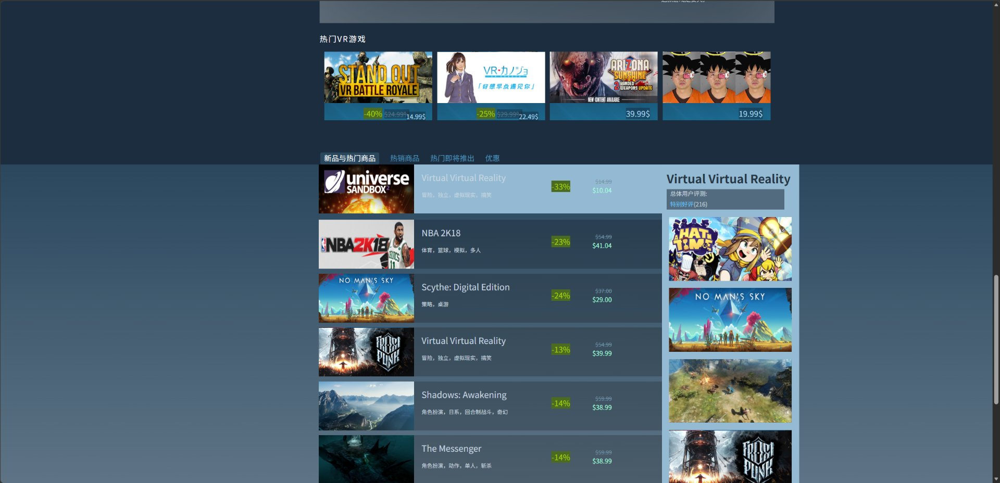
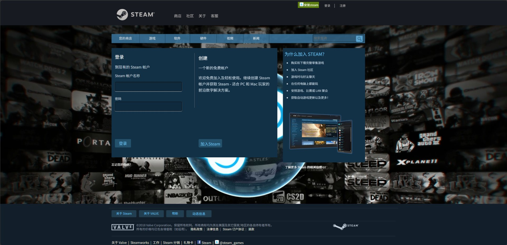
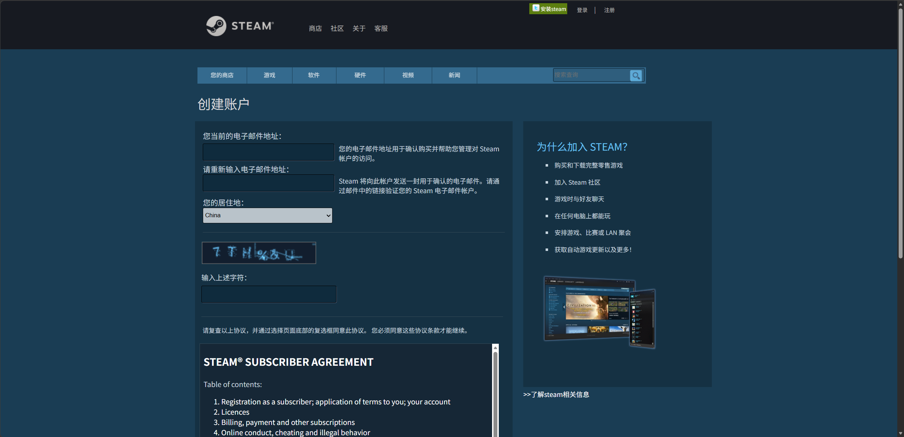

# Steam 静态网页（2018）（纯手搓！！！）

这是 2018 年写的一个前端 Steam 静态网页，用 HTML + CSS 还原了 Steam 商店的页面布局。

## 页面预览

### 首页

商店首页，包含顶部导航、轮播横幅、左侧分类栏和「精选和推荐」商品区。

### 为你推荐鉴赏家 · 热门 VR 游戏

首页下方的鉴赏家推荐模块与热门 VR 游戏列表。

### 新品与热门商品

新品与热门商品列表，鼠标悬停时右侧会浮出商品详情卡片。

### 登录

登录页，背景使用了一段 Steam 相关的循环视频。

### 创建账户

注册页，包含邮箱填写、居住地选择、验证码，以及内嵌的 Steam 订阅协议。

## 页面结构

| 文件 | 说明 |
| --- | --- |
| `zhuye.html` | 首页 |
| `denglu.html` | 登录页 |
| `zhuche/zhuce.html` | 创建账户（注册）页 |
| `zhuche/iframe.html` | 注册页内嵌的订阅协议 |
| `about.html` | 关于 Steam |
| `game.html` ~ `game4.html` | 游戏详情页 |
| `zhuye/a.html` | 首页右侧「DO YOU LIKE VAN YOUXI?」模块 |
| `zhuye/xrjy.html` | 首页「新品与热门商品」列表 |
| `gongg_tobu.html` / `gongg_dibu.html` | 公共头部 / 底部 |
| `css/` `js/` `img/` | 样式、脚本与图片素材 |

## 运行方式

纯静态页面，不需要构建。直接用浏览器打开 `zhuye.html` 即可。

脚本部分只用到 jQuery 1.8.3（`js/jquery1.8.3.js`）。

## 说明

- 页面素材（图片、视频）来自网络，仅作学习交流使用。
- 项目完成于 2018 年，代码与页面效果保留了当时的状态。
- 根目录的 `index.html` 是空文件，入口页面为 `zhuye.html`。
